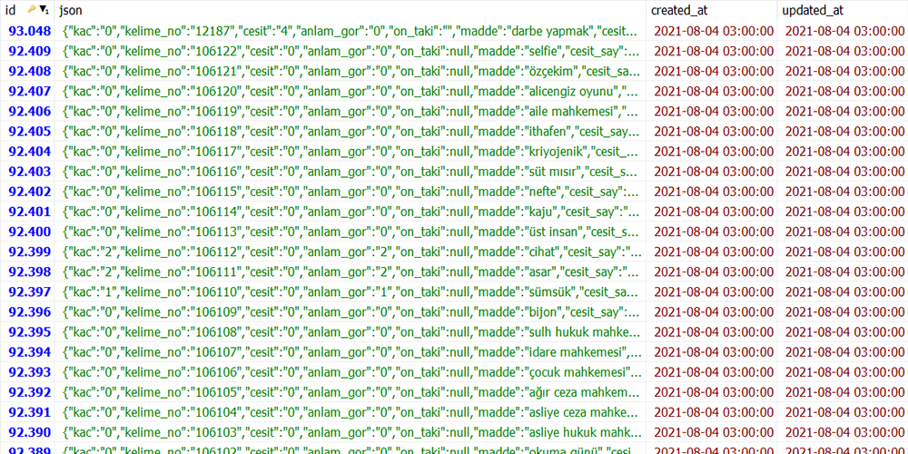

# sozluk-api

Sık sık gereksinim duyduğum ve güncellemeleri izlemek için sozluk.gov.tr'nin Güncel Türkçe Sözlük'ünde yer alan tüm sözleri bir araya topladım. 4 Ağustos 2021 itibarıyla 92407 söz bulunmaktadır.

Github'ın 100 MB sınırı olduğundan ötürü veritabanının küçük olması için her söz sonucunu json olarak kaydettim. Json içindeki madde_id değişkenini kaldırıp id olarak kullandım. Atasözlerini de sıkıştırıp, sadece idleri kullanılacak şekile çevirdim. Veritabanı boyutu 4 Ağustos 2021 itibarıyla yaklaşık 82 MB.

Kullanıma açık kullanıcı arayüzünü görüntülemek için bağlantıya tıklayabilirsin:  
https://sozluk-api.herokuapp.com/words

## Endpointler

### `GET /api/words`

https://sozluk-api.herokuapp.com/api/words

#### `?page`

[https://sozluk-api.herokuapp.com/api/words?page=1283](https://sozluk-api.herokuapp.com/api/words?page=1283)

Sayfalamak için kullanılır. Sayı değeri alır.

#### `?where[]`

[https://sozluk-api.herokuapp.com/words?where[]=json->madde,like,%loji](https://sozluk-api.herokuapp.com/words?where[]=json->madde,like,%loji)

Süzgeçten geçirmek için kullanılır. Sırasıyla; sütun adı\*, operatör\*\* ve süzgeç değerinin aralarında virgül olacak şekilde birleştirilmesiyle oluşturulan bir yazı değeri alır.

#### `?orderBy[]`

Sonuçları sıralamak için kullanılır. Sütun adı\* ve sıralama yönü (ters sıralama istenirse `desc`. varsayılan olarak `asc` gelir.) birleştirilerek oluşturulan bir yazı değeri alır.

[https://sozluk-api.herokuapp.com/words?orderBy[]=json->lisan_kodu,desc](https://sozluk-api.herokuapp.com/words?orderBy[]=json->lisan_kodu,desc)

\* Kullanılabilir sütunlar herhangi bir cevabın içinden görülebilir. Json değişkenleri arasında `->` işareti kullanılır.  
\*\* Kullanılabilir operatörler: `=` `!=` `like` `not like` `ilike` `not ilike` `rlike` `not rlike` `regexp` `not regexp` `<` `>` `<=` `>=` `<>` `<=>` `like binary` `&` `|` `^` `<<` `>>` `~` `~*` `!~` `!~*` `similar to` `not similar to` `~~*` `!~~*`

### `GET /api/words/{id}`

https://sozluk-api.herokuapp.com/api/words/1789
